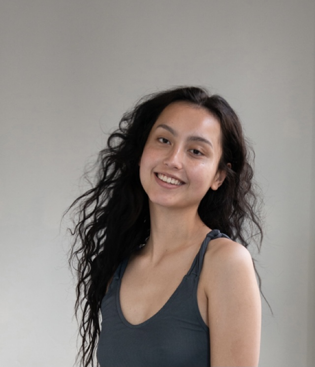

<html>
<head>
<title>Louise e-portfolio</title>
</head>
<body style="background-color:lightgrey;">

<h1 style="color: Black;">Louise hill e-portfolio</h1>
<h1 style="Font-size:200%;">

s3909882 / s3909884@rmit.edu.au

<h1 style="color: Black;">Personal information</h1>
<h1 style="Font-size:100%;">

My name is Louise, I study IT at RMIT after moving from Canberra in
March. I absolutely love Melbourne (especially the food here). I was born
in Cambodia but spent majority of my childhood in Canberra/Sydney
and visiting home every year. I have studied a year of Finance at the
university of Canberra but decided Tech suited me more. My favourite
pastime would be Fashion; sewing and making clothes, but especially
the up and coming trend of digital fashion.

<h1 style="color: black;">Interest in IT</h1>
<h1 style="Font-size:100%;">

STEM in general has always sparked my interest. When i started to design my own clothes i was using 
Different softwares/tools. This inspired me to get involved in the world of technology as my hobbies 
Involved a lot of tech. Not only that but IT has such a vast number of specialisations and is vital in 
numerous amounts of jobs. The possibilities are endless which is one of the main reasons it 
interested me. Not only that but there is a whole world related to IT, which is interesting because you 
learn something new all the time.

In 2020 when the first lockdown happened I had a lot of time on my hands to start a new hobby. I 
Watched a fashion show that was completely digital, this was the first i have seen of that kind. This
Sparked my interest in IT. I was always Interested in coding and finally had time to start, I immediately
 loved it. Coding was very interesting to me because it was like a puzzle. I could write commands for
 my computer which I thought was Intriguing. I wanted to get into a field where the possibilities are 
endless. There will always be a need for tech and It will forever be evolving. 

I chose RMIT because it had an appealing campus, I enjoyed the facilities and the course structure 
of this degree. Many great People are RMIT alumni and I would love to be one of them. Not only that
But there is a strong focus on job prospects after your degree which I find not many universities 
have.

In this degree i would love to learn how to do more complex coding, AI, making a website and cyber 
Security. I would also love to learn aspects of IT that I never knew existed before. I expect to be fully 
Immersed in the IT world by the time i graduate.

<h1 style="color: Black;">Ideal job - Web developer</h1>
<h1 style="Font-size:130%;">
 <a href="https://www.seek.com.au/job/53400250?type=standout#searchRequestToken=c6f2460f-89fe-4576-be85-60c3c0d0f799t">Visit seek.com </a>

A full stack web developer designs and develops websites for businesses and individuals. They work
Both with the back end coding and front end presentation. This is appealing to me because i would 
Love to work closely with people and build websites. 

For this position a degree or qualification in IT, strong skills in CSS, HTTPS, Java and experience 
As a creative or web developer is vital. But most importantly, good people skills. As you are working 
In close proximity to people. Gaining trust and being a pleasure to work with will benefit me 
The most.

Currently I have some experience in the creative industry and basic coding knowledge. I have worked
In the industry and networked with creatives for over a year now and feel as though i have a good 
grasp of what’s desirable and what is not. Of course there a niches that i am still open to getting 
knowledge on (for instance the music industry).

By doing a degree in IT I will obtain the skills to create and design websites. This degree will also 
teach me how to fit into the job, what to expect and how to expand my knowledge. During the period
I am studying I plan to network with a lot of creatives/it specialist to ensure i know what to expect 
And how to grow in this industry.

<h1 style="color: Black;">Profile</h1>
<h1 style="Font-size:100%;">

<h1 style="color: Black;">Results of tests</h1>
<h1 style="Font-size:130%;">

For the Myers-Briggs test the result was ENJT.

<a href="https://www.16personalities.com/">Visit 16personalities.com</a>

For the learning style test it was found that i am a visual learner.

 <a href="http://www.educationplanner.org/students/self-assessments/learning-styles-quiz.shtml">visit educationplanner.com</a> 
 
For the personality perfect test; ENFJ.

 <a href="https://www.personalityperfect.com/test/free-personality-test/">visit personalityperfect.com</a> 
 

<h1 style="color: Black;">What does this mean to me?</h1>
<h1 style="Font-size:130%;">

These tests determine your personality. The myers briggs test determines how you perceive the 
world,How you feel about social interactions, how you process things and how you work through 
problems.This test Showed that i am an ENTJ(Extraversion (E), Intuition (N), Thinking (T), 
Judgment (J)), this means i am extroverted so I feel empowered by social interactions, I follow my 
intuition which meansI make decisions based on how i feel rather than using facts. With the learning 
the style test showed that I was a visual learner. This means i like to be shown how to to something or 
I need pictures/tutorials in order to learn. The perfect personality test was very similar to the Myers-Briggs test. It showed that i was a ENFJ. Extroverted (E), Intuitive (I), Feeling (F) and Thinking (T) these results are almost identical to the Myers-Briggs test. Which means i have a good grasp on what my personality is. 
 
According to the Myers Briggs test, ENTJ are good leaders with the ability to be controlling. I think
this may Interfere with how cohesive the team works. But as long as there is mutual respect and 
communication there shouldn't be a problem.  

I aim to form a team with multiple types of people. So we can all learn together, make sure to have
a strong understanding of the roles everyone is assigned to. Most importantly communicate the issues 
We have and are open minded to changing ideas.

I am passionate about being creative, for innovation I would like to see IT used in a different way to work with businesses and organisations to increase productivity and creativity. Creating different formats for websites, talking to other IT specialists and creatives to see how they would improve these formats would dramatically improve my knowledge and experience. Most importantly being open to constructive criticism. 
 

<h1 style="color: Black;">Project ideas</h1>
<h1 style="Font-size:130%;">

Create a dicitation software that can be used for ecommerce websites. By utilising CMU sphinx, KALDI and HTK.

